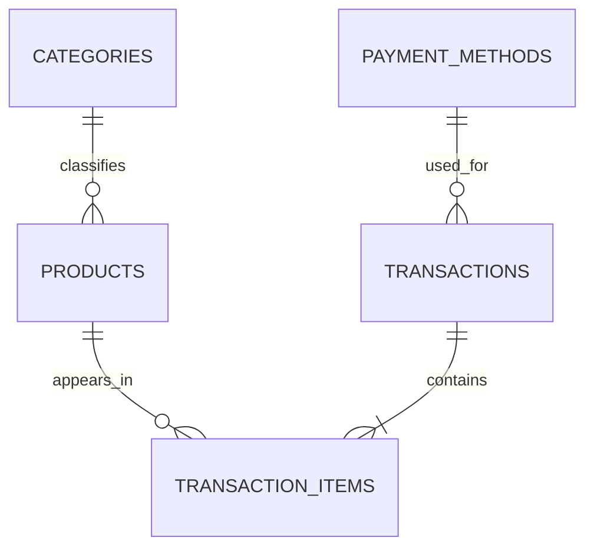
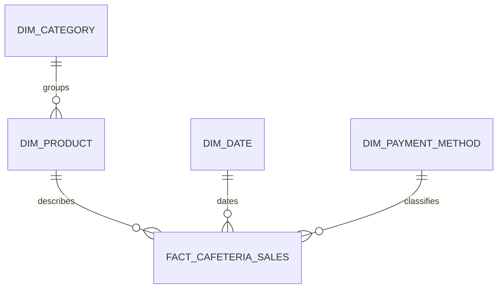

# Campus Cafeteria Sales Warehouse

A PostgreSQL portfolio project that begins with normalized cafeteria checkout
tables and transforms completed sales into a dimensional warehouse for
reporting.

The project is deliberately small enough to explain in an interview, while
still demonstrating database design, historical pricing, dimensional modeling,
repeatable loading, grain-aware metrics, and data reconciliation.

## Questions answered

- How much net revenue was earned by day and month?
- Which category sold the most units?
- How do cash and digital payments compare?
- What is the average number of units sold per completed transaction?
- How do revenue and transaction value change by weekday?
- Do the operational database and warehouse return the same revenue?

## Verified sample result

The supplied deterministic data generator produces:

| Measure | Result |
|---|---:|
| Date range | 2026-04-06 to 2026-06-28 |
| Operational checkouts | 288 |
| Completed checkouts | 273 |
| Cancelled checkouts | 15 |
| Operational line items | 720 |
| Warehouse fact rows | 681 |
| Units sold from completed checkouts | 766 |
| Net revenue | PHP 34,815.00 |

Cancelled checkouts remain in the operational system for audit purposes but do
not enter the warehouse.

## Architecture

The project uses two PostgreSQL schemas inside one database:

- `oltp` records individual checkouts and their product lines.
- `dw` reorganizes completed product lines for analytical queries.

### Operational model



### Warehouse model



Because category is stored separately from product, the analytical model is a
small snowflake rather than a completely denormalized star.

## Declared fact grain

> One row in `dw.fact_cafeteria_sales` represents one product line from one
> completed cafeteria transaction.

This statement controls how the metrics must be calculated. For example:

- `COUNT(*)` counts sold product lines.
- `COUNT(DISTINCT transaction_id)` counts completed checkouts.
- `SUM(quantity)` counts units.
- `AVG(quantity)` is not the average units per transaction.

The correct average-units calculation is:

```sql
SUM(quantity)::NUMERIC
/
NULLIF(COUNT(DISTINCT transaction_id), 0)
```

## Repository structure

```text
cafeteria-sales-warehouse/
├── README.md
├── run_all.sql
├── docs/
│   └── data_dictionary.md
├── results/
│   └── query_results.md
└── sql/
    ├── 00_reset_project.sql
    ├── 01_create_schemas.sql
    ├── 02_create_oltp_tables.sql
    ├── 03_insert_sample_data.sql
    ├── 04_create_dw_tables.sql
    ├── 05_load_dimensions.sql
    ├── 06_load_fact_table.sql
    ├── 07_analysis_queries.sql
    ├── 08_data_quality_checks.sql
    ├── 09_compare_oltp_and_olap.sql
    └── 10_explain_examples.sql
```

## Run the project

### Requirements

- PostgreSQL 14 or newer
- Permission to create and drop schemas in a practice database

Do not run the project in a database that already uses schemas named `oltp` or
`dw`. The reset script drops those two schemas and everything inside them.

### Option 1: PostgreSQL command line

From the repository root:

```bash
createdb cafeteria_sales
psql -d cafeteria_sales -f run_all.sql
```

`run_all.sql` uses `psql` commands such as `\ir`, stops at the first error, and
runs files `00` through `09`. The query-plan examples are left optional because
their timing depends on the computer:

```bash
psql -d cafeteria_sales -f sql/10_explain_examples.sql
```

### Option 2: online PostgreSQL editor

Open the files in numerical order and execute each file separately:

1. `00_reset_project.sql`
2. `01_create_schemas.sql`
3. `02_create_oltp_tables.sql`
4. `03_insert_sample_data.sql`
5. `04_create_dw_tables.sql`
6. `05_load_dimensions.sql`
7. `06_load_fact_table.sql`
8. `07_analysis_queries.sql`
9. `08_data_quality_checks.sql`
10. `09_compare_oltp_and_olap.sql`

Run `10_explain_examples.sql` only if the editor supports
`EXPLAIN (ANALYZE, BUFFERS)`. Do not paste `run_all.sql` into an editor that
does not support `psql` backslash commands.

## Business rules implemented

- Every product belongs to one category.
- Every checkout contains one or more unique product lines.
- Every checkout uses one payment method.
- Quantities must be positive.
- Prices and discounts cannot be negative.
- A line discount cannot exceed its gross amount.
- The charged price is stored on the line item, so later menu-price changes do
  not rewrite history.
- Only `COMPLETED` checkouts enter the fact table.
- Business dates are derived in the `Asia/Manila` timezone.
- Net revenue is:

  ```text
  (quantity × historical unit price) − discount
  ```

## Loading approach

Dimensions load first because the fact table needs their surrogate keys. Each
dimension keeps the corresponding operational ID in a unique `source_*_id`
column.

The dimension and fact loads use `ON CONFLICT` upserts, so they can be run
again without duplicating rows. Before loading facts, the script also removes
rows whose source checkout is no longer completed. After the load, a PostgreSQL
block compares source and warehouse row counts and revenue; a mismatch aborts
the transaction.

## Main findings from the sample

These findings describe the generated practice data, not actual cafeteria
customers:

- May has the highest monthly revenue at PHP 12,570.00.
- Beverages lead unit volume with 217 units.
- Rice Meals produce the most category revenue at PHP 13,315.00.
- Digital payments account for PHP 18,820.00, or 54.06% of net revenue.
- Average units per completed checkout are 2.81.
- Friday has the highest weekday revenue and average transaction value.

The complete output is documented in
[`results/query_results.md`](results/query_results.md).

## OLTP and OLAP are serving different work

| Concern | `oltp` schema | `dw` schema |
|---|---|---|
| Primary purpose | Record checkouts | Analyze completed sales |
| Model | Normalized relational tables | Dimensions and fact |
| Common workload | Inserts and small lookups | Joins, grouping, and totals |
| Historical price | Stored on each checkout line | Copied into each sales fact |
| Transaction status | Includes completed and cancelled | Contains completed sales only |
| Example question | Which products are on receipt 104? | Which weekday earns the most revenue? |

`09_compare_oltp_and_olap.sql` calculates monthly revenue independently from
both schemas and labels every month as `MATCH` or `MISMATCH`.

## Data-quality checks

`08_data_quality_checks.sql` returns a compact test report covering:

- completed-line row reconciliation;
- net-revenue reconciliation;
- duplicate source lines;
- missing dimension lookups;
- invalid fact measures;
- accidental loading of cancelled sales;
- deterministic sample counts; and
- the complete 2026 date dimension.

All ten checks return `PASS` for the supplied build.

## Skills demonstrated

- PostgreSQL schemas, identities, constraints, and indexes
- One-to-many relationships and foreign keys
- Normalized OLTP design
- Fact grain and surrogate dimension keys
- Date-dimension generation with `generate_series()`
- Timezone-safe business-date conversion
- CTEs, joins, aggregate functions, and window functions
- Deterministic synthetic data generation
- Upserts and repeatable ETL loading
- Source-to-warehouse reconciliation
- `EXPLAIN ANALYZE` plan inspection

## Limitations and next steps

The data is synthetic, all sales come from one cafeteria, and the warehouse
uses current product attributes rather than preserving every historical
attribute change. Reasonable extensions include:

- product cost and profit measures;
- a serving-counter or branch dimension;
- a time-of-day dimension;
- inventory and stock-out events;
- an ETL run log and incremental watermark;
- Type 2 slowly changing product dimensions; and
- materialized monthly summaries for a larger dataset.

For this version, the main design goal is a traceable path from normalized
transactions to validated analytical results.
