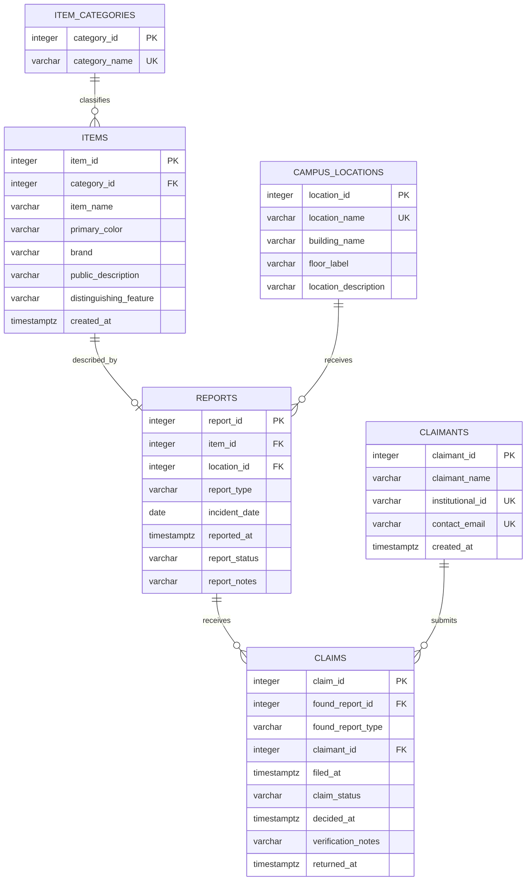

# Entity-Relationship Diagram

## Relationship notes

- One category can classify many items; each item has one category.
- An item can have zero or one report because `reports.item_id` is unique.
- One location can receive many reports; each report has one location.
- A found report can receive many claims; each claim belongs to one found report.
- One claimant can submit claims for different found reports.
- The database allows only one approved claim per found report.
- The `claims` composite foreign key requires the referenced report type to be `FOUND`.

