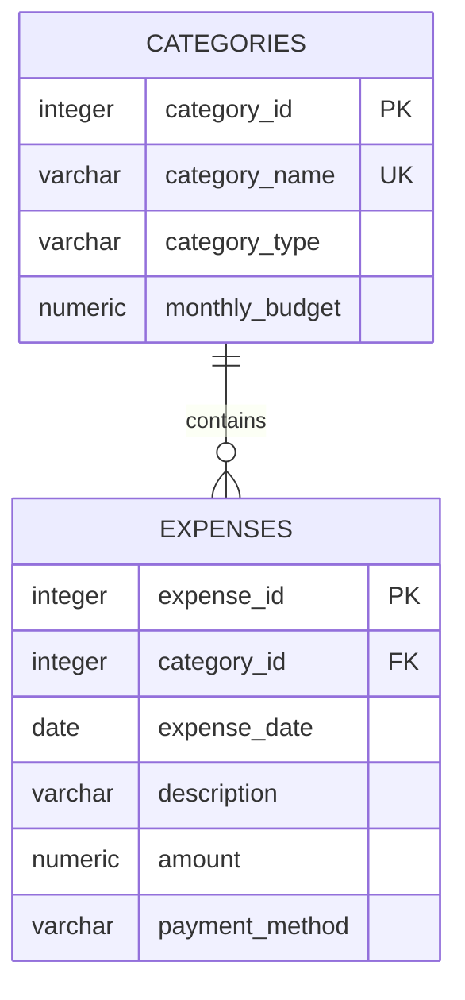

# Entity-Relationship Diagram

## Relationship explanation

- One category can contain zero or many expenses.
- Every expense must belong to exactly one valid category.
- `expenses.category_id` references `categories.category_id`.
- A category cannot be deleted while expenses still reference it because the
  foreign key uses `ON DELETE RESTRICT`.
